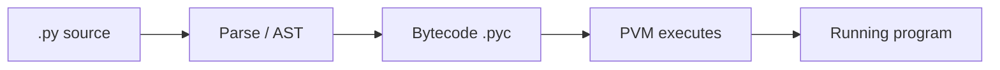

This note collects **core ideas** plus **small runnable patterns** aligned with my `1.LLD Introduction` study folder. Use it as a checklist when designing or reviewing code—not a full dump of those modules.

---

## 1. Classes vs objects

- **Class** — blueprint: shared behavior and **class variables** (one copy for the type).
- **Object** — instance: **`self.…`** state that differs per object.

```python
class Car:
    fleet_count: int = 0  # class variable — shared

    def __init__(self, brand: str, model: str):
        self._brand = brand
        self._model = model
        self._speed = 0
        Car.fleet_count += 1

    def accelerate(self, delta: int) -> None:
        self._speed += delta


a = Car("porsche", "gt3")
b = Car("bmw", "m3")
# a._speed != b._speed  → instance state
# Car.fleet_count == 2  → class-level counter
```

---

## 2. `@classmethod` vs `@staticmethod`

- **`@classmethod`** receives **`cls`** (the class object). Use it when the logic belongs to the **type**, not one instance: read/update **class variables**, **alternative constructors** (`from_json`, `from_dict`), or anything that must return **`cls(...)`** so subclasses get the right type.
- **`@staticmethod`** receives **no** implicit first argument. Use it for a **pure helper** that only needs its parameters—no instance state, no class state. It is a function **grouped under the class name** for discoverability.

**One-line check:** need **`cls`** or to build **`cls(...)`** → classmethod. Need **neither** `self` nor `cls` → staticmethod (or a module-level function).

```python
from typing import Any


class Order:
    total_orders: int = 0

    def __init__(self, order_id: str, status: str):
        self.order_id = order_id
        self.status = status
        Order.total_orders += 1

    def update_status(self, new_status: str) -> None:
        self.status = new_status

    @classmethod
    def get_total_orders(cls) -> int:
        return cls.total_orders

    @classmethod
    def from_dict(cls, data: dict[str, Any]) -> "Order":
        return cls(
            order_id=data["id"],
            status=data.get("status", "pending"),
        )

    @classmethod
    def create_draft(cls, order_id: str) -> "Order":
        return cls(order_id=order_id, status="draft")

    @staticmethod
    def validate_order_id(order_id: str) -> bool:
        return bool(order_id) and len(order_id) >= 3 and order_id.isalnum()

    @staticmethod
    def calculate_discount(price: float, percent: float) -> float:
        return price * (percent / 100.0)


# No instance needed for staticmethod
assert Order.validate_order_id("ORD001")

o = Order.from_dict({"id": "ORD002", "status": "confirmed"})
```

---

## 3. Compile time vs runtime (especially in Python)

**Early phase:** parse → AST → bytecode. **Later:** run opcodes, real values, dynamic dispatch.

```python
# Caught when the file is compiled/parsed (before meaningful run):
# if True   # SyntaxError: expected ':'

# Caught while executing:
def boom() -> None:
    return 1 / 0


# boom()  # ZeroDivisionError at runtime
```

**Runtime polymorphism** — which `area()` runs depends on the **actual** object type:

```python
from abc import ABC, abstractmethod


class Shape(ABC):
    @abstractmethod
    def area(self) -> float: ...


class Circle(Shape):
    def __init__(self, r: float):
        self.r = r

    def area(self) -> float:
        return 3.14159 * self.r**2


class Square(Shape):
    def __init__(self, s: float):
        self.s = s

    def area(self) -> float:
        return self.s**2


def total_area(shapes: list[Shape]) -> float:
    return sum(s.area() for s in shapes)  # dispatch at runtime


total_area([Circle(1.0), Square(2.0)])
```

**Python’s two-step model:** `.py` → bytecode (often `__pycache__/*.pyc`) → interpreter. **Type hints** do not, by themselves, add runtime checks.

---

## 4. `@dataclass`

Boilerplate-free data types; still allow methods and class/static methods.

**When to use `@dataclass`:** the type is mostly **labeled fields** (DTOs, config rows, events, API payloads) and you want **`__init__` / `__repr__` / `__eq__`** generated for you, plus optional **`frozen`**, ordering, or **`__post_init__`** validation.

**When to use a normal class instead:** behavior and lifecycle dominate—**connections**, **threads**, **heavy custom construction**, **invariants** spread across many methods—or you **do not** want dataclass equality/repr semantics. A common split is a small dataclass for data and a separate service class for behavior.

```python
from dataclasses import dataclass, field


@dataclass
class OrderRow:
    order_id: str
    status: str
    total: float = 0.0

    def is_confirmed(self) -> bool:
        return self.status == "confirmed"


@dataclass
class ShoppingCart:
    user_id: str
    items: list[str] = field(default_factory=list)

    def __post_init__(self) -> None:
        if not self.user_id:
            raise ValueError("user_id cannot be empty")

    def add(self, item: str) -> None:
        self.items.append(item)


@dataclass(frozen=True)
class User:
    email: str
    name: str
```

**Rules:** no mutable literals as defaults—use `field(default_factory=list)` for lists/dicts. Fields without defaults must come **before** fields with defaults.

---

## 5. `Enum` and `StrEnum`

| | **`Enum`** | **`StrEnum`** (3.11+) |
|---|------------|------------------------|
| **What a member “is”** | Its own enum type; string lives in **`.value`**. | Also a real **`str`** subclass. |
| **Compare to `"text"`** | Usually **False** unless you use **`.value`**. | Often **True** when the string matches (e.g. HTTP verbs, wire strings). |
| **Use when** | Closed set of **named constants** you do **not** treat as plain strings. | Values are **naturally strings**; you want **`str`** APIs and f-strings without always writing **`.value`**. |

**`Enum`** — compare member to member; use **`.value`** for the underlying string.

```python
from enum import Enum


class OrderStatus(Enum):
    PLACED = "placed"
    CONFIRMED = "confirmed"
    SHIPPED = "shipped"


s = OrderStatus.CONFIRMED
assert s.value == "confirmed"
assert s != "confirmed"  # not a plain str
```

**`StrEnum`** (3.11+) — member **is** a `str`; handy for APIs and f-strings.

```python
from enum import StrEnum


class HttpMethod(StrEnum):
    GET = "GET"
    POST = "POST"


m = HttpMethod.GET
assert m == "GET"
assert isinstance(m, str)
assert f"{m} /api" == "GET /api"
```

---

## 6. Interface vs abstract class (in Python)

Same tooling: **`ABC`** + **`@abstractmethod`**. Difference is **intent**: contract-only vs shared implementation. In languages with a real `interface` keyword the split is explicit; in Python you express both with ABCs and **name/design** them differently.

| | **Interface** (contract / capability) | **Abstract class** (shared family) |
|---|----------------------------------------|-------------------------------------|
| **Main job** | Say **what** exists, not **how** it works. | Share **common code** and leave **gaps** for subclasses. |
| **Concrete methods** | Typically **none** (pure protocol). | **Allowed**—helpers, defaults, template methods. |
| **State (fields)** | Usually minimal; “capability” only. | Often **constructors and fields** shared by subclasses. |
| **Relationship** | **Can do X** (`Flyable`) across unrelated types. | **Is a kind of Y** (`Vehicle`) with shared behavior. |
| **Multiple bases** | Several small interfaces per class is common. | Often **one** rich base; multiple ABCs in Python are possible but add complexity. |

**Python note:** only **`@abstractmethod`** members → **interface-style**; **concrete + abstract** methods → **abstract class** in this sense—the **syntax** is the same.

**Interface-style** (only abstract methods):

```python
from abc import ABC, abstractmethod


class PaymentGateway(ABC):
    @abstractmethod
    def charge(self, amount: float) -> bool: ...

    @abstractmethod
    def refund(self, txn_id: str) -> bool: ...


class StripeGateway(PaymentGateway):
    def charge(self, amount: float) -> bool:
        return True

    def refund(self, txn_id: str) -> bool:
        return True
```

**Abstract class** (concrete helpers + abstract hooks):

```python
from abc import ABC, abstractmethod


class PaymentProcessor(ABC):
    def __init__(self, name: str):
        self.name = name
        self.log: list[str] = []

    def validate(self, amount: float) -> bool:
        return 0 < amount < 1_000_000

    def record(self, msg: str) -> None:
        self.log.append(msg)

    @abstractmethod
    def pay(self, amount: float) -> bool: ...


class PayPal(PaymentProcessor):
    def __init__(self):
        super().__init__("paypal")

    def pay(self, amount: float) -> bool:
        if not self.validate(amount):
            return False
        self.record(f"paid {amount}")
        return True
```

---

## 7. Code execution flow (high level)

**Python (CPython):** source **→** parse / AST **→** **bytecode** (`.pyc` in `__pycache__` when cached) **→** **PVM** runs opcodes. Contrast with a **native** toolchain: preprocess → compile → link → **machine code** the CPU runs directly.

Inspect bytecode for a tiny function (study aid, not production code):

```python
import dis


def double(x: int) -> int:
    return x * 2


# dis.dis(double)  # uncomment locally to see LOAD_FAST, BINARY_OP, RETURN_VALUE
```

Simplified Python path:



**Memory (conceptual):** **stack** for frames and locals; **heap** for objects; **text/code** segment read-only. Python objects mostly live on the heap with reference semantics.

---

## What goes in the next post

Pillars like **encapsulation, abstraction, inheritance, composition, polymorphism** get a dedicated article—this file stays focused on **mechanics and small patterns** you can paste into an LLD repo or notebook.
