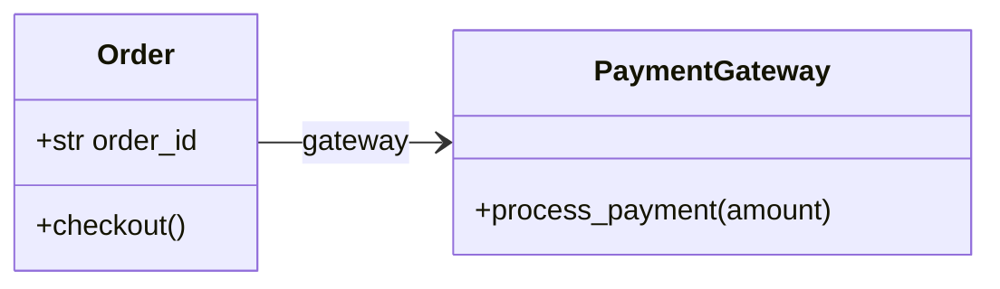
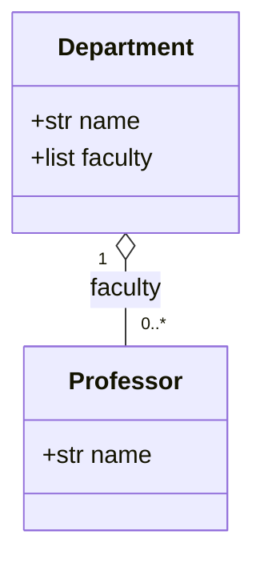
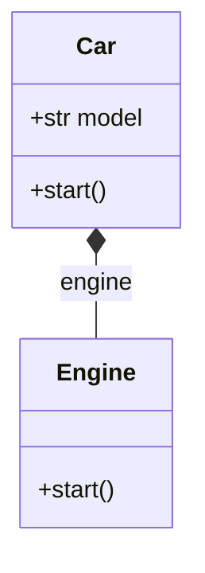
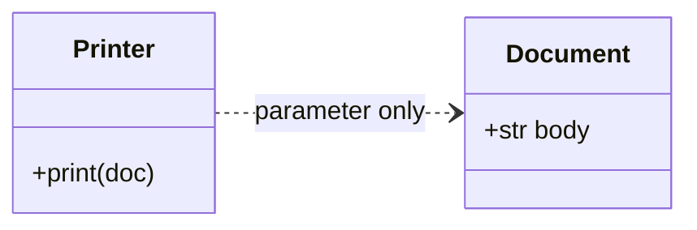
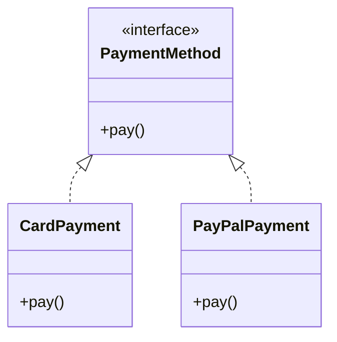

In low-level design you draw **lines between types** to show how responsibilities collaborate. This note groups the usual UML-style **structural relationships**: what they mean, **when to choose them**, and a minimal code shape for each. It mirrors ideas from a **`2.Class Relationship`** study set (association → realization).

Below each topic, a **Mermaid `classDiagram`** gives a UML-like sketch you can paste into [Mermaid Live](https://mermaid.live) or any Markdown preview that supports Mermaid (this site uses the same syntax).

---

## 1. Association

**What it is:** One class **knows** another via a **long-lived reference** (`knows-a`). The linked objects usually have **independent lifetimes**: destroying one does not automatically destroy the other.

**When to use:** Two entities must **collaborate** over time (navigate from A to B), but neither **owns** the other in a whole–part sense. Often **one-way** (Order → Gateway) or **two-way** (Team ↔ Developer).

**Key points**

- Reference is typically **stored** (attribute), not only passed through a single method.
- Weaker than composition; stronger than a one-off dependency.
- Multiplicity matters in design (one-to-many, many-to-many)—even if code uses lists or optional references.

**Example — Order knows a shared `PaymentGateway`**

```python
class PaymentGateway:
    def __init__(self, name: str) -> None:
        self.name = name

    def process_payment(self, amount: float) -> bool:
        print(f"[{self.name}] charge ${amount:.2f}")
        return True


class Order:
    def __init__(self, order_id: str, gateway: PaymentGateway) -> None:
        self.order_id = order_id
        self.gateway = gateway  # association: stable reference
        self.total = 0.0

    def checkout(self) -> None:
        self.gateway.process_payment(self.total)


stripe = PaymentGateway("Stripe")
Order("A", stripe).checkout()  # gateway outlives any single order
```

**UML sketch (Mermaid)** — solid arrow: stable “knows” link, independent lifetimes.



---

## 2. Aggregation and composition

Both are **whole–part** (“has-a”), but **ownership and lifetime** differ.

### Aggregation (weak has-a, ◇)

**What it is:** The whole **groups** parts that **can exist without** the whole. Parts are often **created outside** and **injected**; the same part may even appear in **several** wholes.

**When to use:** Departments and professors, playlists and songs, UI panels that **reference** shared widgets.

**Key points:** Pass parts **into** the constructor; deleting the container **does not** delete the parts.

```python
class Professor:
    def __init__(self, name: str) -> None:
        self.name = name


class Department:
    def __init__(self, name: str, faculty: list[Professor]) -> None:
        self.name = name
        self.faculty = faculty  # aggregation: professors live outside


p = Professor("Dr. Lee")
cs = Department("CS", [p])
del cs  # Professor `p` still exists
```

**UML sketch (Mermaid)** — hollow diamond on the **whole** side: aggregation (parts exist outside).



### Composition (strong part-of, ◆)

**What it is:** The whole **owns** the parts; parts **should not outlive** the whole or are meaningless without it. Parts are often **created inside** the whole’s constructor.

**When to use:** Car–engine (for strict ownership story), `University`–`Department` where departments exist only as part of that university.

**Key points:** Whole created → parts created; whole discarded → parts go away **conceptually** (in Python, GC handles objects; design intent is what matters).

```python
class Engine:
    def start(self) -> None:
        print("engine on")


class Car:
    def __init__(self, model: str) -> None:
        self.model = model
        self.engine = Engine()  # composition: part born with the car

    def start(self) -> None:
        self.engine.start()
```

**UML sketch (Mermaid)** — filled diamond: composition (part owned by whole).



**Quick contrast**

| | **Aggregation** | **Composition** |
|---|-----------------|-----------------|
| Part without whole | **Can** make sense | Usually **no** |
| Where parts are made | Often **outside**, passed in | Often **inside** whole |
| Share part across wholes | **Yes**, common | **No** (one owner) |

---

## 3. Dependency

**What it is:** A **uses-a** link that is **temporary**. A class **mentions** another to do a job (parameter, local variable, return type) but typically **does not** keep it as persistent state.

**When to use:** “I need a `Printer` / `Formatter` / `Clock` **only inside this method**.” Good for **low coupling** if you avoid storing the collaborator as `self.x` unless that becomes association.

**Key points**

- Appears in **signatures** and **method bodies**, not as “always there” attributes.
- UML: **dashed arrow** (`- - →`).
- If everything becomes a dependency injected everywhere, consider introducing an **association** or **interface** to clarify the model.

**Example — printer uses a document only for the call**

```python
class Document:
    def __init__(self, body: str) -> None:
        self.body = body


class Printer:
    def print(self, doc: Document) -> None:
        # no self._doc — dependency is scoped to this method
        print(doc.body)


Printer().print(Document("hello"))
```

**UML sketch (Mermaid)** — dashed arrow: **dependency** (uses `Document` only in `print`, no stored field).



---

## 4. Realization

**What it is:** A concrete class **implements** a **contract** (interface, abstract base class, or `Protocol`). UML: **dashed line with hollow triangle** (`- - -▷`) from class to interface.

**When to use:** You want **swappable implementations** behind one API (`PaymentMethod`, `Repository`, `ExportFormat`) or to **test** with fakes.

**Key points**

- **Interface / ABC** = *what*; concrete class = *how*.
- Python: `ABC` + `@abstractmethod`, or **`Protocol`** for structural typing.
- Multiple classes may **realize** the same interface differently (polymorphism at runtime).

**Example — several payments, one contract**

```python
from abc import ABC, abstractmethod


class PaymentMethod(ABC):
    @abstractmethod
    def pay(self, amount: float) -> bool: ...


class CardPayment(PaymentMethod):
    def pay(self, amount: float) -> bool:
        print(f"card ${amount}")
        return True


class PayPalPayment(PaymentMethod):
    def pay(self, amount: float) -> bool:
        print(f"paypal ${amount}")
        return True


def checkout(method: PaymentMethod, total: float) -> None:
    method.pay(total)


checkout(PayPalPayment(), 42.0)
```

**UML sketch (Mermaid)** — dashed line + closed triangle toward the **contract**: **realization** (implements).



---

## Summary table

| Relationship | Core idea | Lifetime / reference | Typical code cue | UML (informal) |
|--------------|-----------|----------------------|------------------|----------------|
| **Association** | Knows-a | **Independent**; stored ref | `self.peer = peer` | Solid arrow |
| **Aggregation** | Weak has-a | Part **outlives** whole | Parts **passed in** | Hollow diamond |
| **Composition** | Strong part-of | Part **with** whole | Part **constructed in** `__init__` | Filled diamond |
| **Dependency** | Uses-a | **Temporary** | Type in **parameter** / local | Dashed arrow |
| **Realization** | Implements | N/A (contract) | `class X(ABC):` / `Protocol` | Dashed + hollow triangle |

---

## Related notes

- **[OOP pillars](/posts/four-characteristics-oop/)** — composition vs inheritance in behavior, polymorphism.
- **[Basic OOP](/posts/basic-oop/)** — ABCs, `classmethod`, and syntax that supports these relationships.
